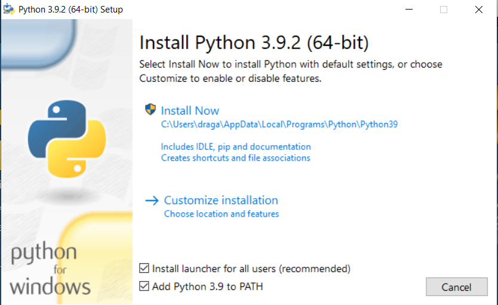
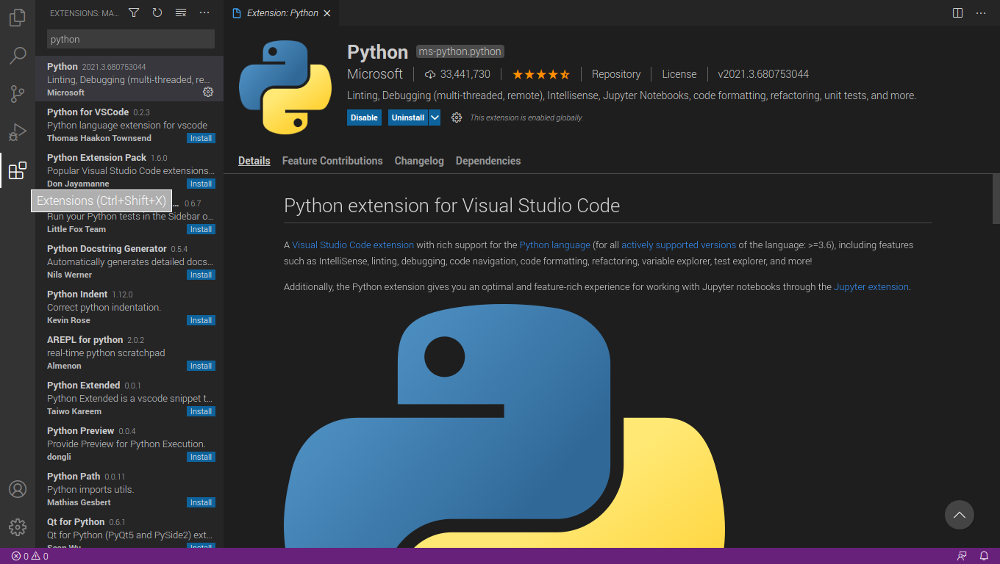
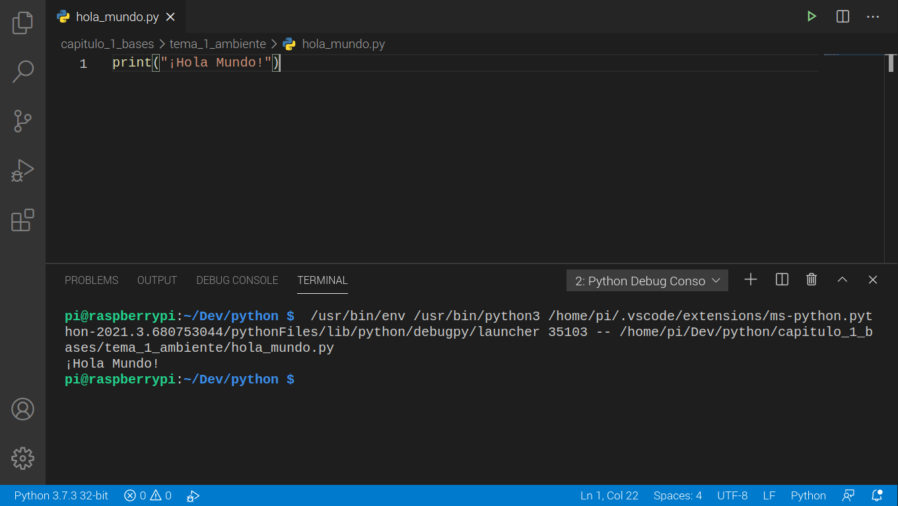

# Instalar nuestro ambiente de trabajo

En este módulo instalaremos la versión correcta de python y los programas necesarios para poder escribir nuestro código en python.

## Instalar la versión correcta de python

En este curso ocuparemos la versión más reciente de python 3 y nuestro codigo correra sin problemas en cualquier version superior a python 3.6

### Windows

Generalmente python no viene instalado en windows, lo que hace muy probable que tengamos que instalarlo

Para instalarlo entraremos a la pagina de [python.org](https://www.python.org/downloads/windows/) baja el instalador y ejecutalo como cualquier otro programa, al correr el instalador, revisa que la opción de agregar al PATH esté seleccionada



Una vez terminada la instalación abre Powershell y corre python

Si el programa te regresa la versión de python instalada la instalación ha sido correcta

### Mac

En la mayoría de los sistemas MacOs python viene instalado por defecto

Abre la terminal y corre python

Si te regresa un versión menor a python 3, corre el comando python3

Si te regresa una versión superior a python 3.6 continua, si no instala la version mas actual de python 3 desde [python.org](https://www.python.org/downloads/mac-osx/)

### Linux

En la mayoría de distribuciones Llinux viene instalado por defecto python corre python3 y si la versión que parece es mayor a python 3.6 continua si no instala la versión más reciente de python para tu distribución.

## Instalando Visual Studio Code

Ingresa a [code.visualstudio.com](https://code.visualstudio.com/) y descarga el instalador correcto para tu sistema.

Sigue la instalacion normal para el sistema

Una vez instalado visual studio code ábrelo y selecciona la pestaña de extensiones busca python e instala la extensión de microsoft, esto nos ayudará  a autocompletar el código de python y hacer nuestro trabajo mucho más fácil.



## ¡HOLA MUNDO!

Crea una carpeta en donde guardarás tus archivos, la ruta que yo te recomiendo es ~/dev/curso_python

Abre esa carpeta desde visual studio code.

Genera un archivo nuevo al que llamaremos hola_mundo.py

Y escribe dentro de el el siguiente codigo

```python
print("¡Hola Mundo!")
```

Guárdalo yendo a File > Save o con las teclas Ctrl + S, y corre tu programa en Run > Run Without Debugging o con las teclas CTRL + F5, y verás como se ejecuta tu código.



Si quieres correrlo desde tu terminal, simplemente ve a la dirección donde tienes tu script y ejecuta el comando

```bash
$ python3 hola_mundo.py
¡Hola Mundo!
```

Felicidades haz terminado la primera lección y escrito tu primer código con python.
